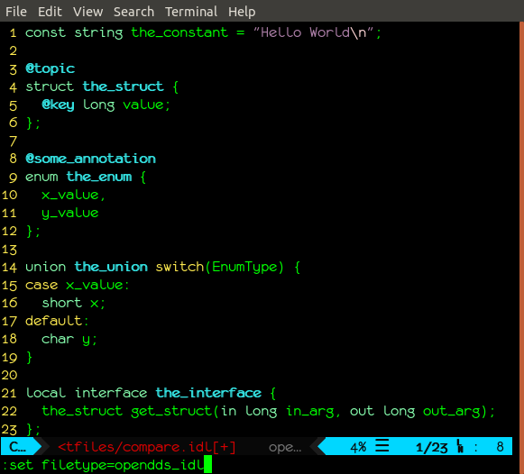

###########
vim-opendds
###########

``vim-opendds`` is a vim plugin with a collection of settings and language
support to make working with `OpenDDS
<https://github.com/objectcomputing/OpenDDS>`_, `ACE/TAO
<https://github.com/DOCGroup/ACE_TAO>`_, and `MPC
<https://github.com/DOCGroup/MPC>`_ easier.

********
Features
********

C++ Settings According to The OpenDDS Guidelines
================================================

**NOTE:** Still have to figure out how integrate these into the plugin, but
here are the settings that can be put directly in your ``.vimrc`` or
``init.vim`` file without installing this plugin:

.. code-block:: vim

    " Use two spaces instead of tab.
    set tabstop=2 shiftwidth=2 expandtab

    " GCC Specific Syntax
    let c_gnu=1

    " Do not indent case statements
    set cinoptions+=:0

    " Do not indent public, private, etc in classes
    set cinoptions+=g-1

    " Highlight Trailing Space and Other Space Errors
    let c_space_errors = 1

OMG IDL Support
===============

Vim has built-in highlighting support for a language called IDL, but it appears
to be focused on an interface description language created by Microsoft, which
is related, but different from the OMG IDL that OpenDDS uses. It appears to be
close enough to do a decent job, but breaks down in some situations, such as
when OMG IDL version 4 annotations are present. This specifically was what
prompted an OMG IDL specific highlighting support. By default it overrides the
built-in ``idl`` file type when a file with a ``.idl`` filename extension is
loaded.

This is a small example:

MPC Files Support
=================

Support for `MPC <https://github.com/DOCGroup/MPC>`_ ``mpc``, ``mpb``, and
``mwc`` files.

**TODO: More Info, Preview**

Miscellaneous
=============

* Recognizes ``.GNU`` files generated by ``gnuace`` as make files and highlight
  them appropriately.
* Recognizes the TAO IDL Flex and Bison files with their non-standard
  extensions and highlight them appropriately.

*******
Install
*******

It is recommended to use a plugin manager like `vim-plug
<https://github.com/junegunn/vim-plug>`_, which makes handling plugins like
this easy. For vim-plug specifically, once it is set up, add this to your
``.vimrc`` or ``init.vim`` file within the ``Plug`` calls.

.. code-block:: vim

    Plug 'iguessthislldo/vim-opendds'

Then run `:PlugInstall` and the plugin will be downloaded and installed.

If you have a new enough vim, you can also install plugins manually. See
``:help packages`` for more information.
